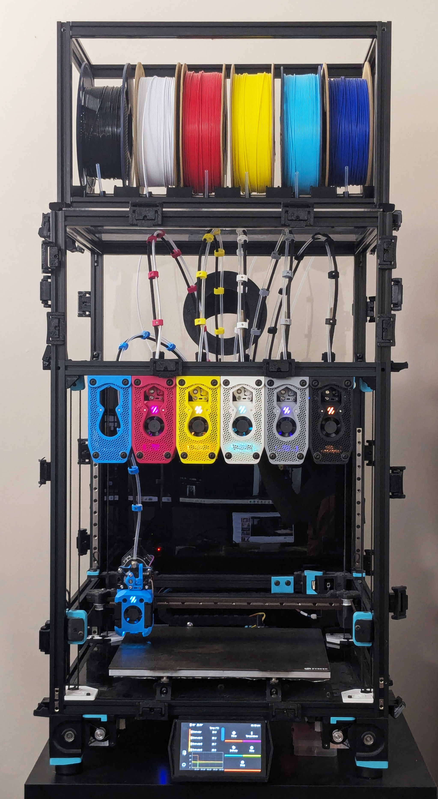

# Voron Stealthchanger CMYK

This repo contains all of the custom files for my 6-toolhead multi-material 3D printer, which is based on a [Voron 2.4](https://github.com/VoronDesign/Voron-2) using the [StealthChanger](https://github.com/DraftShift/StealthChanger) toolchanging system, and the [Tapchanger docking mechanism](https://github.com/viesturz/tapchanger). The build prioritizes performance, maintainability, auto calibration, and aesthetics. The CMYK in the name reffered to my printer color scheme, it's a nod to the subtractive primary colors used by 2D printers and to the capabilities of a multi tool 3D printer especially with slicer advancement like full spectrum color.

Each tool head uses a Dragon Burner toolhead with a Sharkpa Mini Extruder and TZ 2.0 V6 hotend, chosen for their combination of print quality and cost-effectiveness. The entire build is made from 3D printed parts and off-the-shelf hardware.

This repo documents all of the custom and modified components.

---

## Components

### [Toolhead Dock](dock/)

A three-part honeycomb dock, that uses the tapchanger screw hook docking mechanism. The design includes a built-in brush holder for an optional silicone nozzle wipe on every dock and undock.

---

### [Umbilical Backplate](umbilical-backplate/)

A backplate as the single disconnect point for all six toolhead umbilicals. CAN bus cables connect via GX12-4 jacks and filament guide tubes via ECAS04 quick-connect collets, providing a straight low-friction filament path and quick disconnect capabilities for maintenance.

---

### [Umbilical Bracket](umbilical-bracket/)

Custom brackets that bundle the CAN bus cable, PTFE filament guide tube, and flat spring steel into a flexible, organized umbilical cable assembly. The brackets clamp firmly to the cable while allowing the tube and spring steel to move freely. Spring steel is used only at the start and end of each umbilical for the ideal balance of structure and flexibility.

---

### [Spool Holder](spool-holder/)

A compact, adjustable spool holder sized to fit within the width of the 300mm Voron 2.4 printer. Built from 2020 aluminum extrusion with roller carriages that slide along two threaded rods, accommodating different spool widths. Designed to be enclosed later and used used as a dry box.

---

### [Dragon Burner Toolhead](dragon-burner-toolhead/)

A custom cowl for the [Dragon Burner](https://github.com/chirpy2605/voron/tree/main/V0/Dragon_Burner) toolhead to dock configured with a Sharkpa Mini Extruder and TZ 2.0 V6 hotend. Produces good print quality while remaining budget-friendly.

---

### [Nozzle Brush Mount](nozzle-brush-mount/)

Mounts a silicone brush and a Sexball probe to a 2020 extrusion. The brush automatically cleans the nozzle during docking; the probe runs automatic XYZ nozzle offset calibration across all six tool heads with a single button press.

---

### [Toolchange Tuning](toolchange-tuning/)

Tuned motion parameters and dock path waypoints to reduce toolchange time. Covers changes to `printer.cfg` and StealthChanger macro configs, including a trimmed 4-waypoint dock path that removes the high-Z ramp-in from the default.

---

### [CAN Distribution Board Mount](can-distribution-board-mount/)

A mount/enclosure for the FYSETC CAN Bus Distribution Board for StealthChanger, giving each of the six toolboards its own switched power channel off the shared CAN bus.

---

## Cost Estimate Guide

A common question is: **"How much does this build cost?"** It's hard to give one number since it depends heavily on your base printer and which components you choose, so the estimate below is broken into three buckets. Prices marked `~` are rough estimates (either an online price I haven't personally paid, or a ballpark for small hardware I didn't individually source/track) - everything else links to what I actually bought.

> Most purchase links in this guide (AliExpress, Amazon) are affiliate links - using them may earn me a small commission at no extra cost to you.

### Summary

| Bucket | Est. Cost | Details |
|--------|-----------|---------|
| Base Printer | Varies (~$839.10+ for a 300mm kit) | [Section 1](#1-base-printer) |
| Base Toolchanger Upgrade (one-time) | ~$68.01 | [Section 2](#2-base-toolchanger-upgrade-one-time) |
| Per-Toolhead Cost (each ~$92.32 ×6 for this build) | ~$553.92 | [Section 3](#3-per-toolhead-cost) |
| Misc Hardware | ~$50 | [Section 5](#5-filament--miscellaneous-hardware) |
| Filament, single color | ~$20 | [Section 5](#5-filament--miscellaneous-hardware) |
| **Estimated total (for a 6-toolhead upgrade, excl. base printer cost and additional filament colors)** | **~$694** | |
| + Spool Holder (optional add-on, not in total above) | +$96.48 | [Section 4](#4-additional-components) |

If you're building a different number of toolheads, swap in `Per-Toolhead Cost (each)` × your count instead of the ×6 row.

### 1. Base Printer

The cost of your [Voron 2.4](https://github.com/VoronDesign/Voron-2) (or similar) kit/scratch-build and any fundamental upgrades needed to get it running. This varies too widely by vendor/region to estimate here, but as a reference point, recently the best price I've found for a 300mm kit is the Formbot kit at $839.10: [AliExpress](https://www.aliexpress.us/item/3256807677153373.html).

### 2. Base Toolchanger Upgrade (one-time)

Shared components needed to convert the printer to multi-toolhead, regardless of toolhead count.

| Item | Est. Total Cost | Source | Note |
|------|-----------|--------|------|
| BTT U2C CAN Bridge | $20.80 | [AliExpress](https://s.click.aliexpress.com/e/_c3FzcP0n) | Host-side USB-to-CAN adapter |
| FYSETC CAN Bus Distribution Board for StealthChanger | $19.99 | [Fabreeko](https://www.fabreeko.com/products/can-bus-distribution-board-for-stealth-changer-by-fysetc) | Splits CAN bus to each toolboard, see [CAN Distribution Board Mount](can-distribution-board-mount/) |
| [Umbilical Backplate](umbilical-backplate/) hardware | $6.54 | | ECAS04 + GX12-4 Jack; remaining screws/heatsets covered by the misc hardware estimate in section 5 |
| [Nozzle Brush Mount](nozzle-brush-mount/) hardware | | | Brush + screw + nut covered by the misc hardware estimate in section 5 |
| Sexball Probe Assembly | $20.68 | [Sexball BOM](https://github.com/DraftShift/StealthChanger/wiki/Bill-of-Materials#sexball-probe) | External project; endstop + dowel pins + probe balls priced, see [Nozzle Brush Mount](nozzle-brush-mount/) BOM |

**Known subtotal: ~$68.01**

### 3. Per-Toolhead Cost

The cost of one fully functional toolhead, including its dock and umbilical. Multiply by the number of tools you plan to run (this build uses 6).

| Item | Est. Total Cost | Note |
|------|-----------|------|
| [Dragon Burner Toolhead](dragon-burner-toolhead/) component selections (hotend, motor, toolboard, probe kit, fans, extruder hardware) | $80.73 | See component BOM for source links |
| [Dragon Burner Toolhead](dragon-burner-toolhead/) backplate mounting hardware | $2.25 | 3x 4x12mm M3 dowel pins |
| [Dragon Burner Toolhead](dragon-burner-toolhead/) cowl mod hardware | $2.25 | 35mm M3 SHCS |
| [Dragon Burner Toolhead](dragon-burner-toolhead/) EBB36 strain relief cover hardware | | Standoffs, heatset, screws, velcro covered by the misc hardware estimate in section 5 |
| [Toolhead Dock](dock/) hardware | $0.15 | Nozzle brush; heatsets/screws covered by the misc hardware estimate in section 5 |
| [Umbilical Bracket](umbilical-bracket/) + umbilical assembly | $6.94 | PTFE guide tube $1.27 + spring steel roll ~$1.67/umbilical ($13.39 roll covers all 8) + CAN cable ~$4.00 (cut from a 6ft 100W shielded USB-C cable, exact cable no longer sold - verify your replacement's rating meets your toolhead electronics' requirements; alternatives: 240W USB-C or chainflex cable); microfit connector comes with the EBB36 board; bracket screw covered by the misc hardware estimate in section 5 |

**Known subtotal per toolhead: ~$92.32**, plus filament and misc hardware (see section 5).
**Known 6-toolhead total: ~$553.92**, plus filament and misc hardware (see section 5).

### 4. Additional Components

Optional add-ons, priced separately since not every build needs them.

| Item | Est. Total Cost | Note |
|------|-----------|------|
| [Spool Holder](spool-holder/) | $96.48 | Bearings, ECAS04, PTFE tube, extrusion, and rod priced; remaining screws/heatsets covered by the misc hardware estimate in section 5 |

### 5. Filament & Miscellaneous Hardware

**Misc hardware estimate: ~$50** for everything not individually sourced above - these are cheap items bought in bulk, not worth tracking per-part. Covers: M3/M5 heatset inserts, various button/socket head cap screws and 2020 roll nuts (dock, spool holder, umbilical backplate/bracket, dragon burner EBB36 cover, CAN distribution mount), the nozzle brush + screw/nut on the Nozzle Brush Mount, velcro/zip ties, and a buffer for the external Dragon Burner Toolhead/StealthChanger backplate assembly hardware (not detailed in this repo's BOM).

Approximate filament weight for the printed parts weighed so far (not cost - filament price varies by brand/color, budget separately):

| Part | Weight | Qty | Total |
|------|--------|-----|-------|
| [Toolhead Dock](dock/) (per dock) | 54g | 6 | 324g |
| [Dragon Burner Toolhead](dragon-burner-toolhead/) (cowl + EBB36 cover, per toolhead) | 75g | 6 | 450g |
| [CAN Distribution Board Mount](can-distribution-board-mount/) | 18g | 1 | 18g |
| [Umbilical Backplate](umbilical-backplate/) | 63g | 1 | 63g |
| [Spool Holder](spool-holder/) end caps | 32g | 2 | 64g |
| [Spool Holder](spool-holder/) roller dividers | 22g | 5 | 110g |

**Known filament total: ~1029g (~1.03kg)** for this 6-toolhead build - **~129g of that scales per toolhead** (54g dock + 75g cowl/EBB36 cover); if you're building a different toolhead count, multiply that 129g by your count instead of 6 and add the fixed ~255g (CAN distribution mount, backplate, spool holder parts). Not yet weighed: [Umbilical Bracket](umbilical-bracket/), Spool Holder tube guides/ports, and [Nozzle Brush Mount](nozzle-brush-mount/) - add those plus a buffer for failed prints/waste to get your real total.

All parts are printed in ABS or ASA (needed for heat resistance near the toolhead/hotend), at a ballpark $20 per 1kg spool.

| Color strategy | Spools needed | Est. Cost |
|-----------------|----------------|-----------|
| 1-2 colors (shared spools) | 1-2 | **~$20-40** |
| 6 unique colors, one per toolhead | up to 6 | ~$120 |

Most vendors only sell full 1kg spools, so unique-per-toolhead colors mean buying up to 6 spools even though each only uses a fraction - the ~$20 base price above assumes you're fine consolidating colors.

**Filaments used in this build**:

| Color | Filament |
|-------|----------|
| Cyan | Polymaker ASA Pop Blue |
| Magenta | MatterHackers Magenta ABS |
| Yellow | MatterHackers Yellow ABS |
| White | PolyLite ABS White |
| Gray | PolyLite ASA Gray |
| Black | PolyLite ASA Black |

You can reference [BOM.csv](BOM.csv) and the individual component READMEs for full parts lists and source links, and swap in your own pricing for anything marked as a rough estimate or covered by the misc hardware estimate above.

