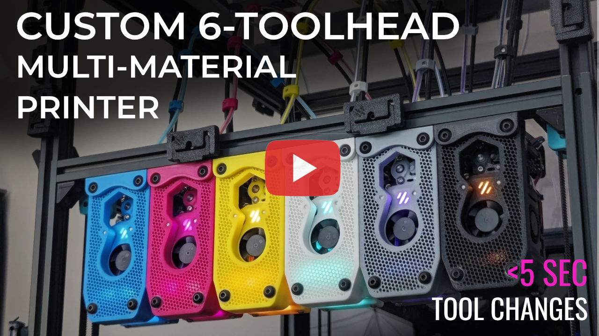
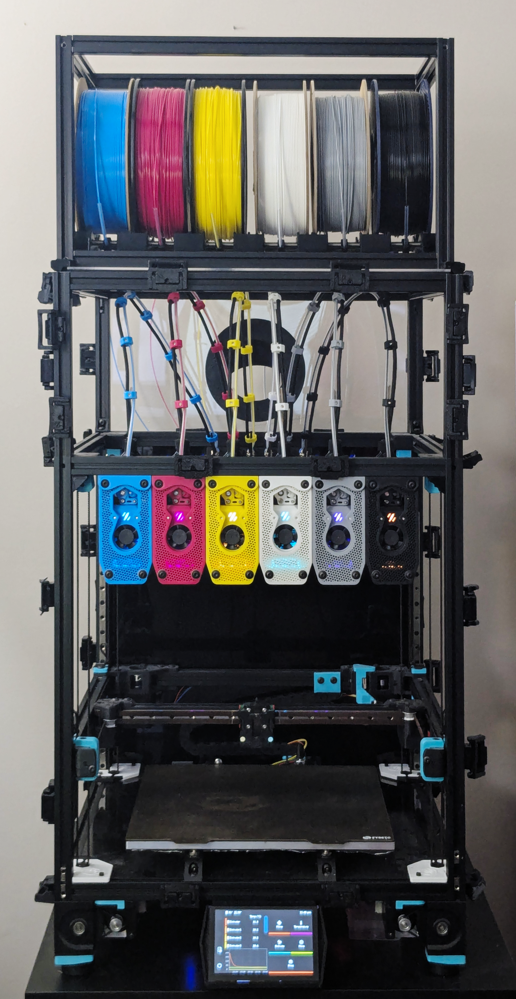
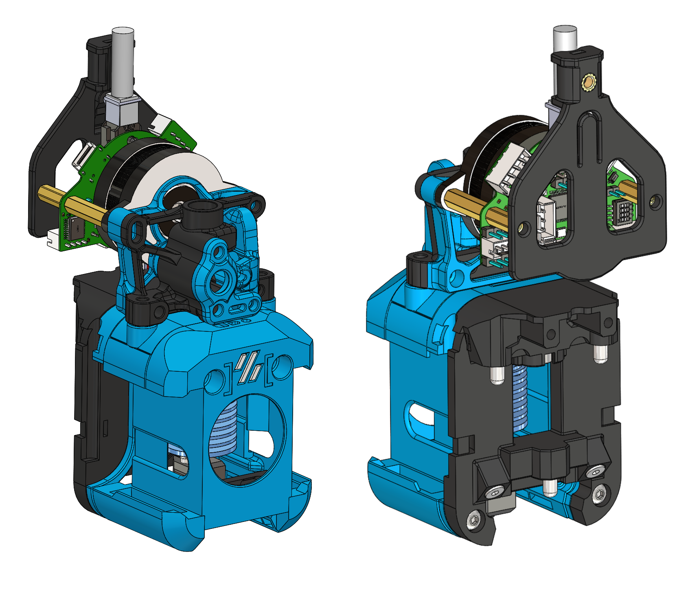
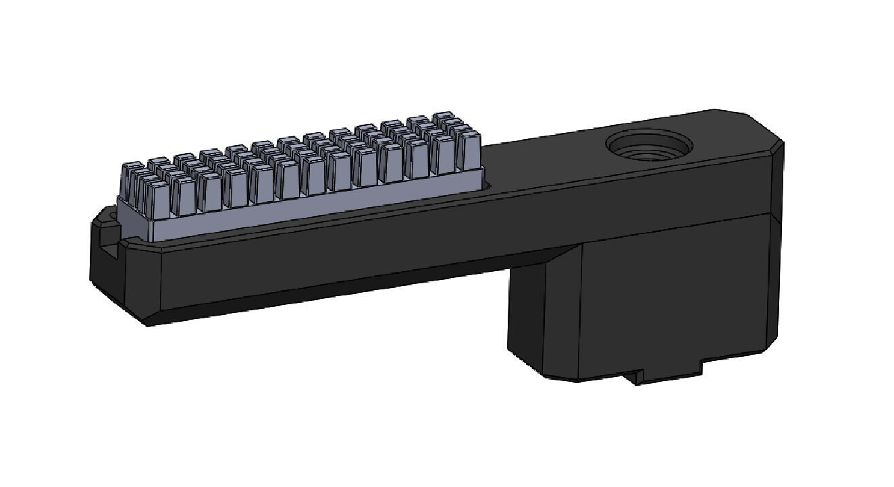

# Voron Stealthchanger CMYK

This repo contains all of the custom files for my 6-toolhead multi-material 3D printer, which is based on a [Voron 2.4](https://github.com/VoronDesign/Voron-2) using the [StealthChanger](https://github.com/DraftShift/StealthChanger) toolchanging system, and the [Tapchanger docking mechanism](https://github.com/viesturz/tapchanger). The build prioritizes performance, maintainability, auto calibration, and aesthetics. The CMYK in the name reffered to my printer color scheme, it's a nod to the subtractive primary colors used by 2D printers and to the capabilities of a multi tool 3D printer especially with slicer advancement like full spectrum color.

Each tool head uses a Dragon Burner toolhead with a Sharkpa Mini Extruder and TZ 2.0 V6 hotend, chosen for their combination of print quality and cost-effectiveness. The entire build is made from 3D printed parts and off-the-shelf hardware.

This repo documents all of the custom and modified components.

## Table of Contents

- [Filaments Used in This Build](#filaments-used-in-this-build)
- [Components](#components)
  - [Toolhead Dock](dock/)
  - [Umbilical Backplate](umbilical-backplate/)
  - [Umbilical Bracket](umbilical-bracket/)
  - [Spool Holder](spool-holder/)
  - [Dragon Burner Toolhead](dragon-burner-toolhead/)
  - [Nozzle Brush Mount](nozzle-brush-mount/)
  - [CAN Distribution Board Mount](can-distribution-board-mount/)
  - [Toolchange Tuning](toolchange-tuning/)
- [Cost Estimate Guide](COST-ESTIMATE.md)
## Filaments used in this build

Finding the right color filaments was quite difficult, since online photos do not always match the actual color. So here are the exact filaments I used so you dont't have to keep buying rolls of filament until you find the right Cyan and Magenta...

| Color | Filament | Source |
|-------|----------|--------|
| Cyan | Polymaker ASA Pop Blue | [Amazon](https://amzn.to/4gcIvKo)
| Magenta | MatterHackers Magenta ABS | [MatterHackers](https://www.matterhackers.com/store/3d-printer-filament/magenta-abs-filament-1.75mm)
| Yellow | MatterHackers Yellow ABS | [MatterHackers](https://www.matterhackers.com/store/l/175mm-abs-filament-yellow-1-kg/sk/M-1NX-QXFR)
| White | Polymaker White ABS | [Amazon (ABS)](https://amzn.to/4cA1c8l) / [Amazon (ASA)](https://amzn.to/45FyLlC)
| Gray | Polymaker Gray ASA | [Amazon (ABS)](https://amzn.to/4xRpfb5) / [Amazon (ASA)](https://amzn.to/3ULpFkU) 
| Black | Polymaker Black ABS | [Amazon (ABS)](https://amzn.to/4zvPRzW) / [Amazon (ASA)](https://amzn.to/4xUeXqN)

---

## Components

<table>
<tr>
<td width="220"></td>
<td>

### [Toolhead Dock](dock/)
A three-part honeycomb dock, that uses the tapchanger screw hook docking mechanism. The design includes a built-in brush holder for an optional silicone nozzle wipe on every dock and undock.
</td>
</tr>
<tr>
<td width="220"></td>
<td>

### [Umbilical Backplate](umbilical-backplate/)
A backplate as the single disconnect point for all six toolhead umbilicals. CAN bus cables connect via GX12-4 jacks and filament guide tubes via ECAS04 quick-connect collets, providing a straight low-friction filament path and quick disconnect capabilities for maintenance.
</td>
</tr>
<tr>
<td width="220"></td>
<td>

### [Umbilical Bracket](umbilical-bracket/)
Custom brackets that bundle the CAN bus cable, PTFE filament guide tube, and flat spring steel into a flexible, organized umbilical cable assembly. The brackets clamp firmly to the cable while allowing the tube and spring steel to move freely. Spring steel is used only at the start and end of each umbilical for the ideal balance of structure and flexibility.
</td>
</tr>
<tr>
<td width="220"></td>
<td>

### [Spool Holder](spool-holder/)
A compact, adjustable spool holder sized to fit within the width of the 300mm Voron 2.4 printer. Built from 2020 aluminum extrusion with roller carriages that slide along two threaded rods, accommodating different spool widths. Designed to be enclosed later and used used as a dry box.
</td>
</tr>
<tr>
<td width="220"></td>
<td>

### [Dragon Burner Toolhead](dragon-burner-toolhead/)
A custom cowl for the [Dragon Burner](https://github.com/chirpy2605/voron/tree/main/V0/Dragon_Burner) toolhead to dock configured with a Sharkpa Mini Extruder and TZ 2.0 V6 hotend. Produces good print quality while remaining budget-friendly.
</td>
</tr>
<tr>
<td width="220"></td>
<td>

### [Nozzle Brush Mount](nozzle-brush-mount/)
Mounts a silicone brush and a Sexball probe to a 2020 extrusion. The brush automatically cleans the nozzle during docking; the probe runs automatic XYZ nozzle offset calibration across all six tool heads with a single button press.
</td>
</tr>
<tr>
<td width="220"></td>
<td>

### [CAN Distribution Board Mount](can-distribution-board-mount/)
A mount/enclosure for the FYSETC CAN Bus Distribution Board for StealthChanger, giving each of the six toolboards its own switched power channel off the shared CAN bus.
</td>
</tr>
<tr>
<td width="220" align="center">🛠️</td>
<td>

### [Toolchange Tuning](toolchange-tuning/)
Tuned motion parameters and dock path waypoints to reduce toolchange time. Covers changes to `printer.cfg` and StealthChanger macro configs, including a trimmed 4-waypoint dock path that removes the high-Z ramp-in from the default.
</td>
</tr>
</table>

---

## Cost Estimate Guide

A common question is: **"How much does this build cost?"** Full breakdown (base printer, toolchanger upgrade, per-toolhead cost, filament, and misc hardware) has moved to its own file: **[COST-ESTIMATE.md](COST-ESTIMATE.md)**.

Quick summary: **~$691** for a 6-toolhead upgrade (excl. base printer and additional filament colors), or **~$92.32** per toolhead if you're building a different count.

