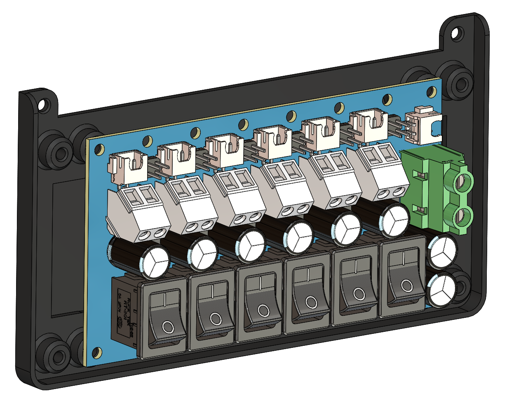

# CAN Distribution Board Mount

A mount/enclosure for the FYSETC CAN Bus Distribution Board for StealthChanger, which splits the CAN bus and switched power out to each of the six toolboards. Each channel has its own rocker switch, letting individual toolheads be powered off independently for maintenance or troubleshooting without shutting down the whole bus.

---

## Bill of Materials

### Printed Parts

| Part | Qty | Note |
|------|-----|------|
| can-distribution-board-mount.STL | 1 | |

### Hardware

| Part | Qty | Unit Cost | Total Cost | Source | Note |
|------|-----|-----------|------------|--------|------|
| FYSETC CAN Bus Distribution Board for StealthChanger | 1 | $19.99 | $19.99 | [Fabreeko](https://www.fabreeko.com/products/can-bus-distribution-board-for-stealth-changer-by-fysetc) | 6-channel switched CAN/power distribution |
| M3 8mm Thread Rolling Screw | 4 | | | | Mounts the distribution board to the mount; covered by overall misc hardware estimate, see main README |
| M3 10mm Socket Head Cap Screw | 2 | | | | Attaches the mount to the Umbilical Backplate; covered by overall misc hardware estimate, see main README |

### Suggested Pairing

Not part of this mount, but a common companion since it needs to connect somewhere upstream on the CAN bus:

| Part | Qty | Unit Cost | Total Cost | Source | Note |
|------|-----|-----------|------------|--------|------|
| BTT U2C CAN Bridge | 1 | $20.80 | $20.80 | [AliExpress](https://s.click.aliexpress.com/e/_c3FzcP0n) | Host-side USB-to-CAN adapter |
