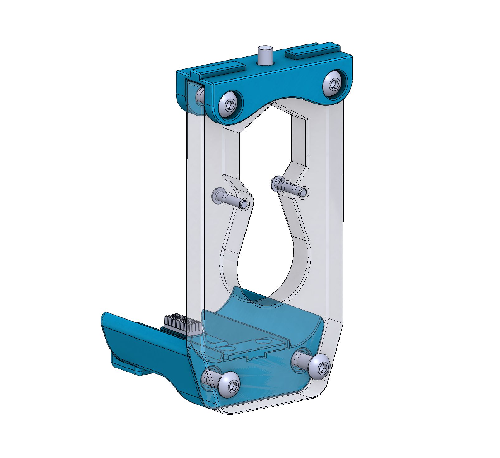
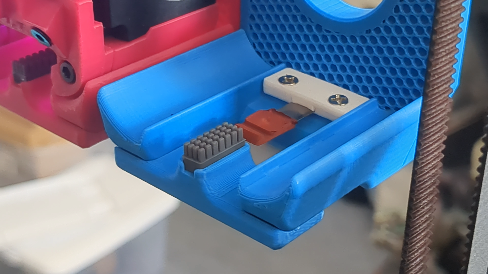
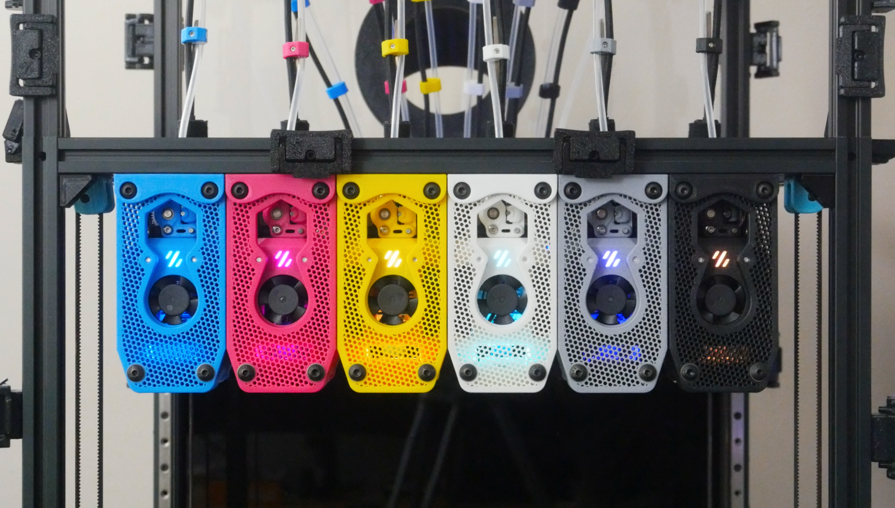

# Toolhead Dock

A three-part dock designed for the StealthChanger system. The docking mechanism hooks the toolhead onto two screw heads, a tap-changer style approach that has proven extremely reliable with zero tool change failures during printing.

The dock was originally designd to use a 10mm acrylic panel as the plate, but it can be printed as well, leavnig the infill exposed lets you see through to the toohead and it doubles as an LED light diffuser. A brush holder on the bottom of the dock accepts an optional silicone nozzle brush so the nozzle is automatically wiped on every dock and undock cycle.

---

## Bill of Materials

### Printed Parts

| Part | Qty |
|------|-----|
| toolhead-dock-base.STL | 1 |
| toolhead-dock-plate.STL | 1 |
| toolhead-dock-bracket.STL | 1 |
| toolhead-dock-brush-holder.STL | 1 |
| Toolhead-dock-nozzle-pad-clip.STL | 1 |

### Hardware

| Part | Qty | Unit Cost | Total Cost | Source | Note |
|------|-----|-----------|------------|--------|------|
| Silicone Nozzle Brush (Bambu Lab A1 Mini size, cut in half) | 1 | $0.15 | $0.15 | [AliExpress](https://s.click.aliexpress.com/e/_c2wvhLBd) | Same brush type as [Nozzle Brush Mount](../nozzle-brush-mount/), cut in half; $2.96 per 10pcs, enough for the whole build + extras |
| M5 Heatset Insert 7mm D x 5mm L | 4 | | | | Covered by overall misc hardware estimate, see main README |
| M3 Heatset Insert 5mm D x 4mm L | 2 | | | | Covered by overall misc hardware estimate, see main README |
| 16mm M5 Button Head Cap Screw | 4 | | | | Covered by overall misc hardware estimate, see main README |
| 10mm M5 Button Head Cap Screw | 1 | | | | Covered by overall misc hardware estimate, see main README |
| 14mm M3 Button Head Cap Screw | 2 | | | | Covered by overall misc hardware estimate, see main README |
| 8mm M3 Button Head Cap Screw | 2 | | | | Covered by overall misc hardware estimate, see main README |
