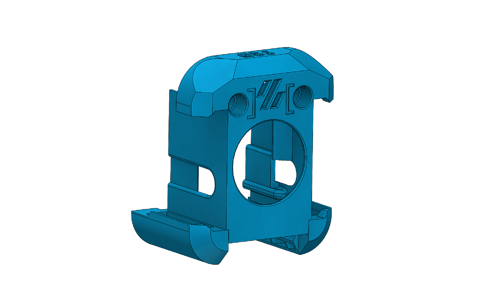

# Dragon Burner Toolhead Cowl

A custom cowl for the [Dragon Burner](https://github.com/chirpy2605/voron-user-mods/tree/main/Universal/DragonBurner) toolhead by chirpy2605. Configured with a Sharkpa Mini Extruder and TZ 2.0 V6 hotend, a combination selected after testing multiple setups for the best balance of print quality and cost.

Six of these toolheads are used across the printer, each printed in its corresponding CMYK color (Cyan, Magenta, Yellow, Black, White, and Gray).

---

## Bill of Materials

### Printed Parts

| Part | Qty |
|------|-----|
| dragonburner-cowl.STL | 1 |
| StealthChanger DragonBurner Backplate | 1 |

### Hardware

| Part | Qty |
|------|-----|
| 35mm M3 Socket Head Cap Screw | 2 |

> The StealthChanger DragonBurner backplate is from the [StealthChanger project](https://github.com/VoronDesign/VoronUsers). For the remainder of the toolhead build (extruder, hotend, PCB, fans, and remaining hardware), refer to the upstream [Dragon Burner project](https://github.com/chirpy2605/voron-user-mods/tree/main/Universal/DragonBurner).
