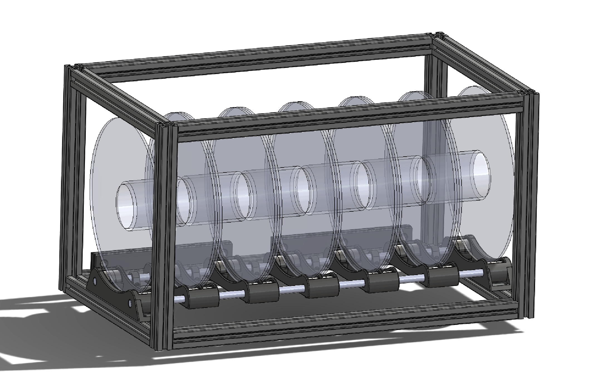
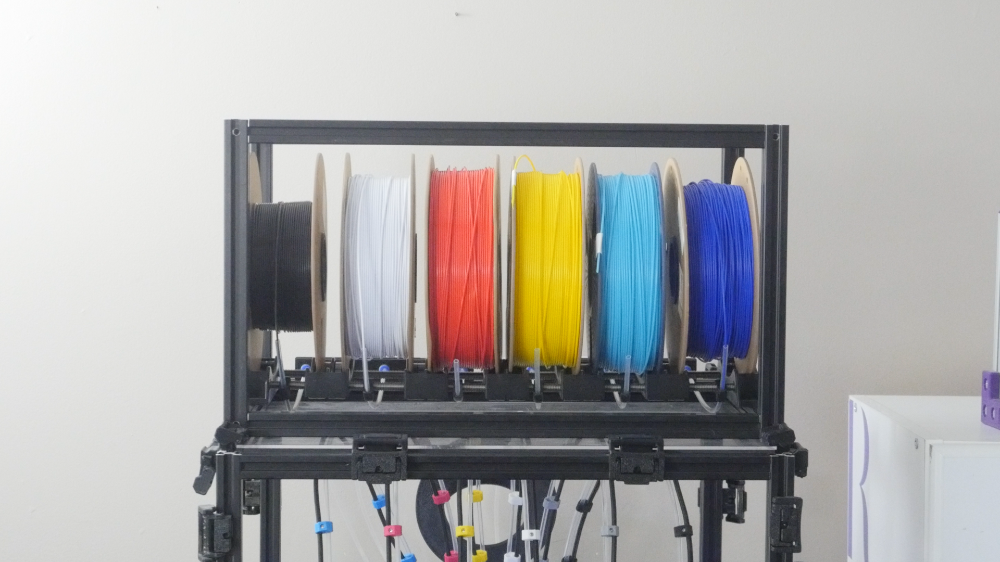
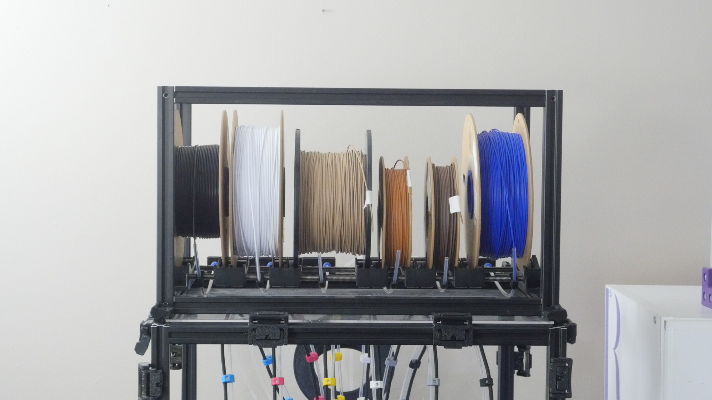

# Spool Holder

A compact, adjustable spool holder designed to sit on top of the printer and fit within the Voron 2.4 30mm's 460mm (18in) width. The frame is built from 2020 aluminum extrusion (matching the printer) with two threaded rods running the length. Roller carriages slide along the rods and can be repositioned to accommodate different spool widths.

Each spool rolls freely on 608 bearings for low-friction feeding. Built-in filament tube guides and quick-release ports route each filament toward the tool heads. The structure is designed to accept enclosure panels later, allowing it to double as a dry box with desiccant.

---

## Bill of Materials

### Printed Parts

| Part | Qty |
|------|-----|
| spool-holder-roller-end.STL | 2 |
| spool-holder-roller-divider.STL | 5 |
| spool-holder-tube-guide.STL | 6 |
| spool-holder-port.STL | 2 |

### Hardware

| Part | Qty | Unit Cost | Total Cost | Source | Note |
|------|-----|-----------|------------|--------|------|
| 2020 Extrusion, 420mm Length | 4 | | $49.99 | [Amazon](https://amzn.to/4hoHVKv) | Cut from a 10pc pack of 500mm bars, only sold as a full pack |
| 2020 Extrusion, 260mm Length | 4 | | | [Amazon](https://amzn.to/4hoHVKv) | Cut from the same pack (pairs with a 240mm piece per bar), cost counted on the 420mm line |
| 2020 Extrusion, 240mm Length | 4 | | | [Amazon](https://amzn.to/4hoHVKv) | Cut from the same pack (pairs with a 260mm piece per bar), cost counted on the 420mm line |
| 8mm x 460mm Threaded Rod | 2 | $9.50 | $18.99 | [Amazon](https://amzn.to/4g3PELE) | Sourced as 2pc pack of 8mm x 500mm linear rod, cut to length |
| 608 Bearings (base) | 4 | $0.27 | $1.07 | [AliExpress](https://s.click.aliexpress.com/e/_c2vzm3aT) | $5.36 per 20-pack, not tied to a toolhead |
| 608 Bearings (per toolhead x6) | 48 | $0.27 | $12.86 | [AliExpress](https://s.click.aliexpress.com/e/_c2vzm3aT) | $5.36 per 20-pack, 8 per toolhead |
| ECAS04 Quick Connect Collet | 12 | $0.25 | $3.00 | [AliExpress](https://www.aliexpress.us/item/3256812555226121.html) | 2 per toolhead x6 |
| PTFE Tube Clear, 4mm OD x 3mm ID (~26in) | 6 | $1.27 | $7.63 | [AliExpress](https://s.click.aliexpress.com/e/_c3qePSft) | $1.93/meter, spool holder to umbilical plate, 1 per toolhead |
| PTFE Tube Clear, 4mm OD x 3mm ID (~10in) | 6 | $0.49 | $2.94 | [AliExpress](https://s.click.aliexpress.com/e/_c3qePSft) | $1.93/meter, internal guide, 1 per toolhead |
| M5 10mm Button Head Cap Screw | 16 | | | | Covered by overall misc hardware estimate, see main README |
| M3 Heatset Insert 5mm D x 4mm L | 4 | | | | Covered by overall misc hardware estimate, see main README |
| M3 12mm Socket Head Cap Screw | 4 | | | | Covered by overall misc hardware estimate, see main README |
| M3 10mm Socket Head Cap Screw | 4 | | | | Covered by overall misc hardware estimate, see main README |
| M3 2020 Roll Nut | 4 | | | | Covered by overall misc hardware estimate, see main README |
