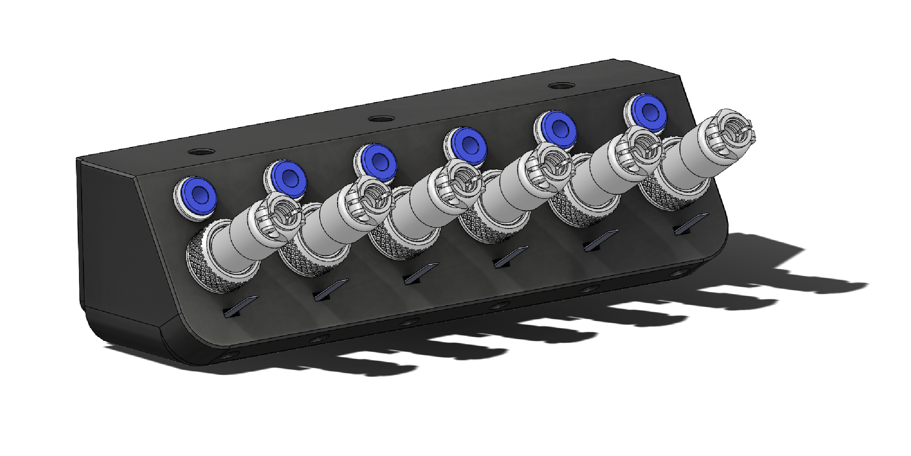
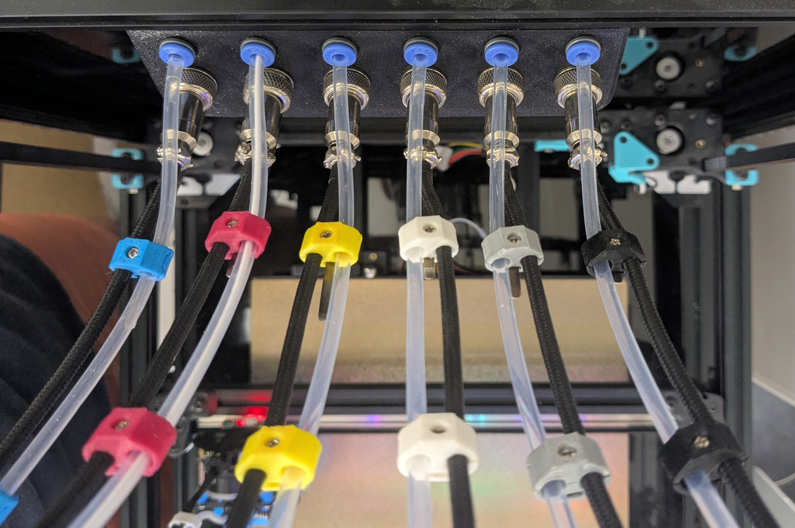

# Umbilical Backplate

A wall-mounted plate that acts as the single connection point where all six toolhead umbilicals enter the printer from the back. The design was driven by ease of maintenance: all connections can be quickly detached for cable troubleshooting, filament tube swaps, or toolhead work without disassembling the printer.

**CAN bus cables** connect via GX12-4 four-pin jacks. **Filament guide tubes** use ECAS04 press-fit quick-connect collets, which allow a straight, low-friction filament path while keeping a low profile to maintain clearance for the wiring below. The plate mounts directly to the printer's 2020 extrusion frame.

---

## Bill of Materials

### Printed Parts

| Part | Qty |
|------|-----|
| umbilical-backplate.STL | 1 |
| umbilical-backplate-nut-retainer.STL | 1 |

### Hardware

| Part | Qty |
|------|-----|
| ECAS04 Quick Connect Collet | 12 |
| GX12-4 Jack | 6 |
| M3 Heatset Insert 5mm D x 4mm L | 6 |
| M3 x 10mm Screw or M3 Set Screw | 6 |
| M5 10mm Button Head Cap Screw | 3 |
| M5 2020 Roll Nut | 3 |
