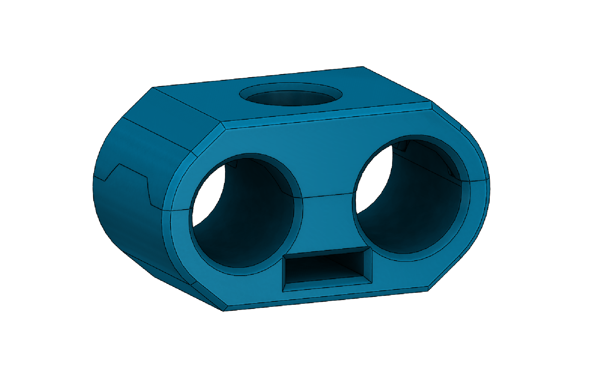

# Umbilical Bracket

A custom two-piece clamp bracket that bundles the three elements of each toolhead umbilical (a CAN bus cable, a PTFE filament guide tube, and flat spring steel) into a single organized assembly.

The bracket clamps firmly onto the CAN bus cable to maintain consistent spacing and orientation along the umbilical, while leaving enough room for the PTFE tube and spring steel to move freely. This gives the umbilical enough structure to stay organized without becoming too stiff to reach all areas of the print bed.

Flat spring steel is used only at the start and end of each umbilical rather than the full length, which proved to be the best balance between structure and flexibility. Eight umbilical assemblies are used in total, one per toolhead (six active + two spare).

---

## Bill of Materials

### Bracket: Printed Parts

| Part | Qty |
|------|-----|
| umbilical-bracket-bottom.STL | 1 |
| umbilical-bracket-top.STL | 1 |

### Bracket: Hardware

| Part | Qty |
|------|-----|
| M3 Thread Rolling Screw | 1 |

---

### Full Umbilical Assembly
*Per umbilical, 8 total (one per toolhead)*

| Part | Qty |
|------|-----|
| Umbilical bracket (assembled) | 8 |
| CAN Bus Cable, 4mm diameter (~23.5 in / 600mm) | 1 |
| PTFE Guide Tube, 4mm OD x 3mm ID (~26 in / 660mm) | 1 |
| GX12-4 Plug | 1 |
| 2x2 Microfit Connector | 1 |
| Flat Coil Spring, 0.3mm x 3mm (70mm length) | 1 |
| Flat Coil Spring, 0.3mm x 3mm (100mm length) | 1 |
